# 如何免费使用X平台的Grok AI图像生成器

---

想在X上生成AI图片却不知道从哪开始?Grok现在对所有用户免费开放了,这意味着你不用付一分钱就能体验AI生成的乐趣。当然,免费用户每两小时只能生成10张图片、发送10条消息,但对于大多数人来说够用了。如果你想知道怎么用Grok做出酷炫的图片,或者想了解它和ChatGPT、Midjourney这些工具有啥区别,继续往下看就对了。

---

## 什么是Grok AI?

Grok是X平台推出的AI助手,和ChatGPT、Claude这些传统AI工具最大的不同在于——它没那么"乖"。它不会对每个敏感话题都绕着走,也不会用那种中规中矩的语气跟你说话。

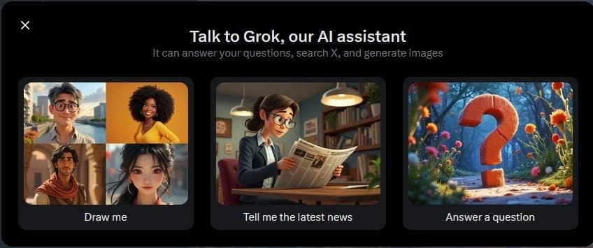

Grok最独特的一点是它能直接读取X上的帖子、对话和媒体内容。你问它最近发生了什么,它会扫一遍X上的讨论给你答案。你还能直接上传图片或PDF让它分析——虽然免费用户每天只能上传3张图片,PDF文件也限制在5MB以内。

Grok用的是Aurora模型,这是X.ai在2024年12月推出的新图像生成引擎。和其他AI工具相比,Aurora生成的图片更自然,纹理也更真实。而且它的限制更少——你可以生成公众人物、虚构角色、动态场景,只要不涉及裸露内容就行。

**免费用户的限制:**
- 每两小时最多发送10条消息
- 每两小时最多生成10张图片  
- 每天最多分析3张图片

想要解锁更多功能?👉 [订阅Grok Super会员一个月成品号(质保30天),直接获得更高使用额度](https://shaoyumi.com/buy/66),不用等待,即刻体验完整版Grok。

## Grok生成的图片是什么样的?

不管你是免费用户还是付费订阅,Grok生成的图片规格都一样:

- **尺寸:** 1024 x 768像素
- **比例:** 4:3
- **水印:** 每张图片右下角都有"GROK ⧄"水印,全屏查看或导出时都会显示
- **格式:** JPEG

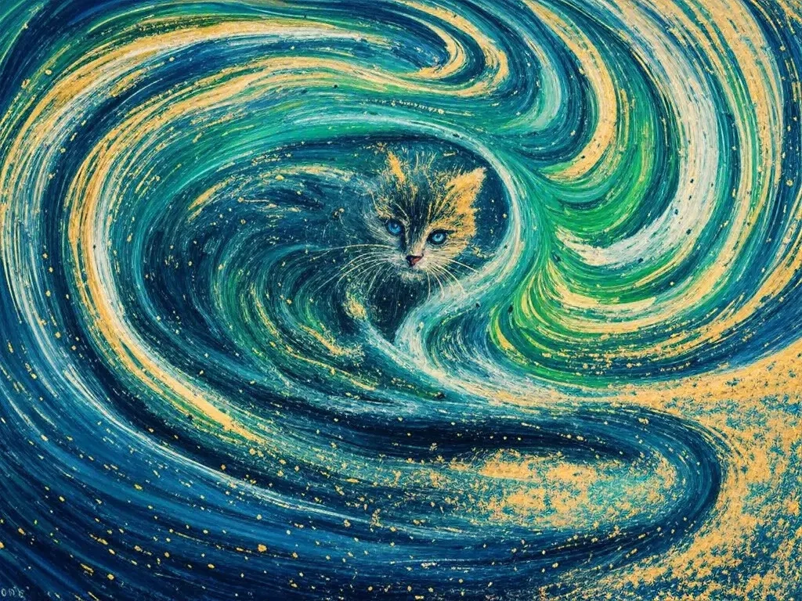

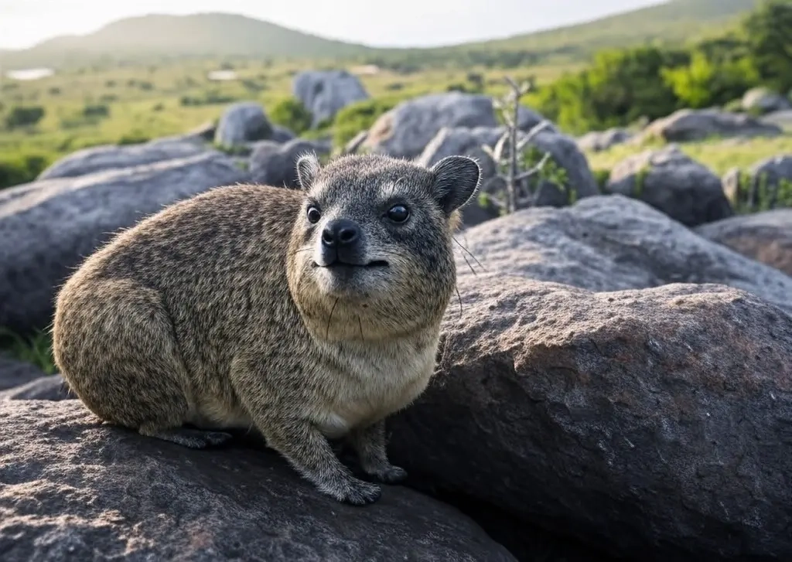

需要注意的是,Grok不支持直接编辑已有图片。如果你想修改某些细节,只能重新生成。

## 怎么找到Grok?

先登录你的X账号,不管是网页版还是手机App都行。

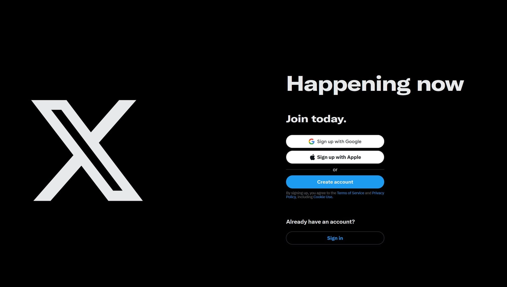

登录后,在侧边栏找一个带斜杠"/"图标的方框——那就是Grok的入口。手机上这个图标在屏幕底部。点进去之后,你就能看到Grok的主界面了。

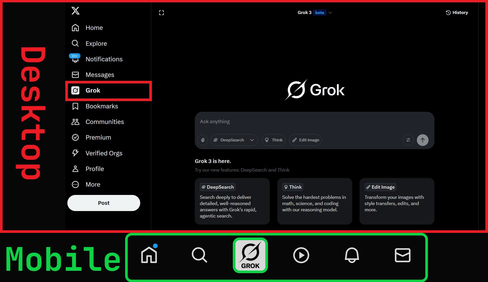

### 桌面端的功能按钮

打开Grok后,屏幕顶部有几个重要按钮:

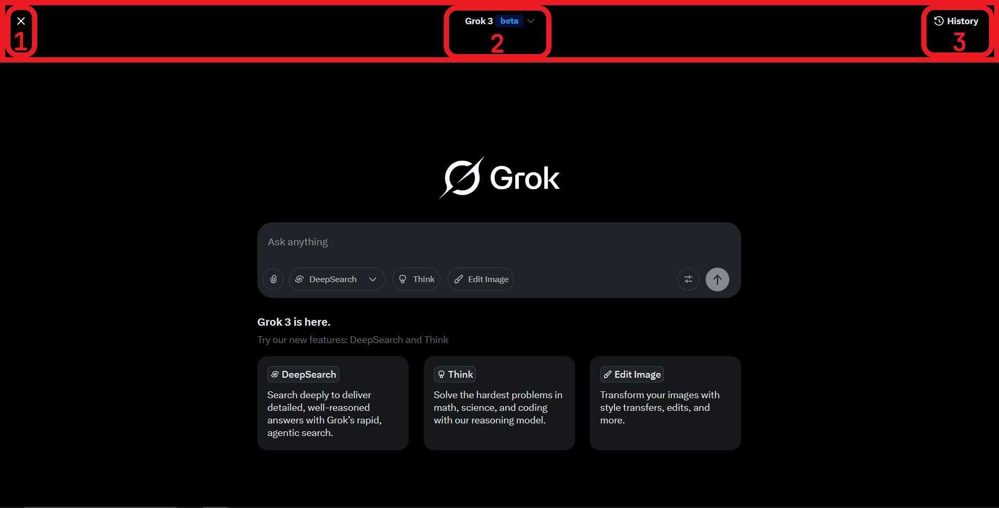

1. **专注模式:** 左上角那个图标能把Grok菜单放大到全屏。想退出全屏就点那个"X"。
2. **AI模型下拉菜单:** 显示当前使用的模型。目前只有Grok 3(截至2025年4月),以后可能会有更多选择。
3. **历史记录:** 查看之前的对话,包括文本和图片内容。

屏幕中间是输入框,这是你和Grok交流的主要工具:

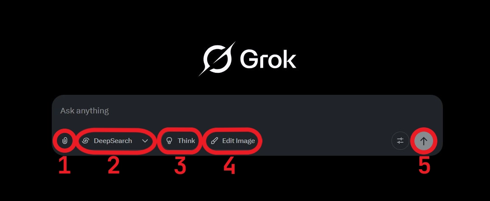

1. **媒体图标:** 上传图片或PDF文件让Grok分析。免费用户每天3次,PDF限5MB。
2. **DeepSearch:** 让Grok"积极搜索互联网"来回答你的问题,获取最新信息。
3. **Think:** 得到详细的分步解释,了解Grok的"思考过程"。
4. **编辑图片:** 上传图片后选这个选项来编辑。
5. **发送按钮:** 提交你的问题或上传的文件。

输入框下面有一些预设的提示词和热门话题,点击就能快速生成内容。

### 手机端的功能按钮

手机App的Grok界面和桌面版差不多,只是布局稍有不同:

**顶部菜单:**
- 点左上角的头像进入个人资料
- 右上角有历史记录和新对话按钮,挨在一起

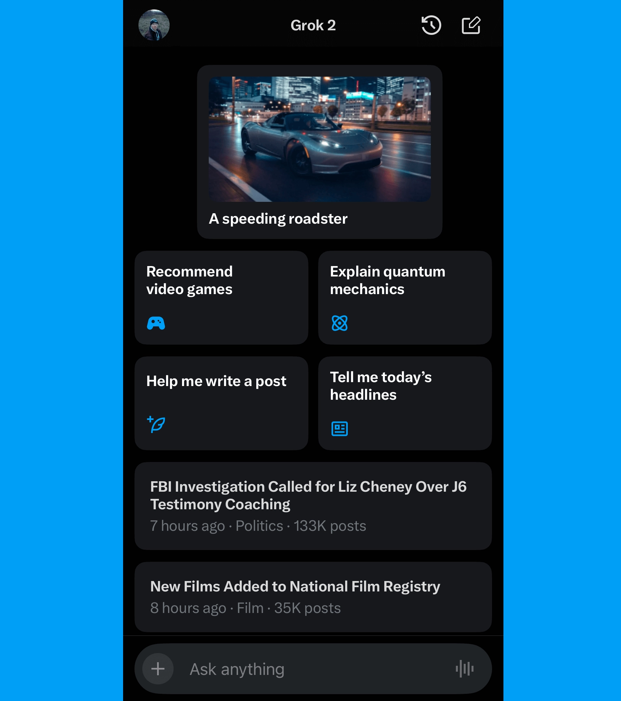

**输入框:**
- 左边的"+"号用来上传文件
- 手机版还有语音输入功能。说出你的问题,Grok会把语音转成文字开始对话(但它不会用语音回答你)

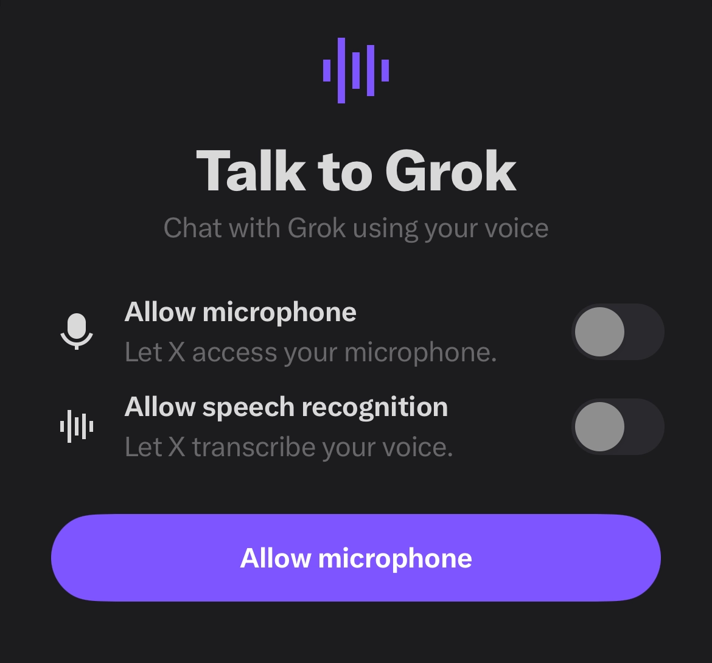

## 怎么用Grok生成图片?

免费用户每两小时能生成10次图片。虽然Grok提供了一些预设提示词,但大多数人还是喜欢自己写描述。操作很简单:

- **打开Grok菜单:** 找到输入框

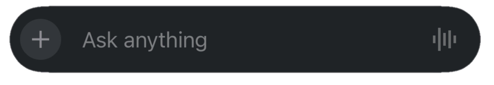

- **输入描述:** 比如"画一只乌龟和一只狗在秋天的城市里玩耍"。Grok会根据你的描述生成两张图片。
- **查看结果:** 选择你喜欢的那张,或者把两张都分享出去。

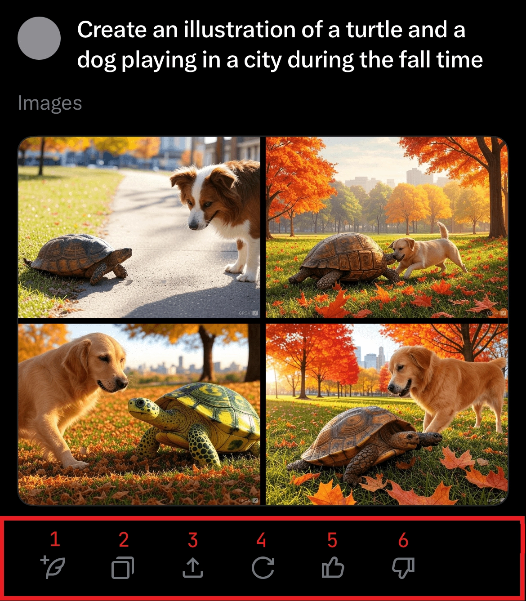

### 图片工具说明

生成的图片下面有6个按钮:

1. **发帖链接:** 直接把图片发到X上
2. **复制到剪贴板:** 复制图片链接,可以分享到任何地方
3. **分享:** 通过邮件、短信或其他App分享
4. **重新生成:** 如果不满意,用同样的描述再生成一次
5. **点赞:** 告诉Grok这张图片符合你的要求
6. **点踩:** 告诉Grok这张图片不行

选择**发帖链接**后,Grok会自动创建一条帖子,包含你的图片和生成时用的描述。

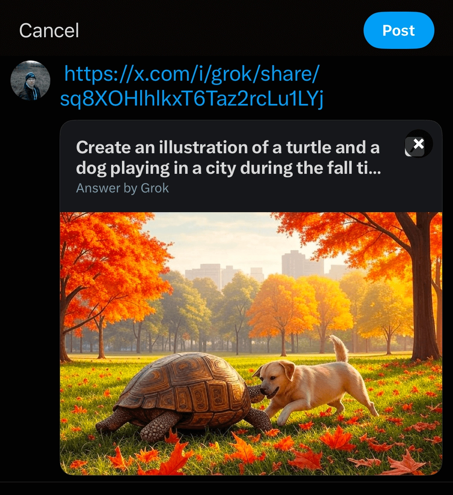

### 桌面端怎么发帖?

桌面版没有直接发帖按钮,但也不麻烦:

1. 点击**分享**按钮

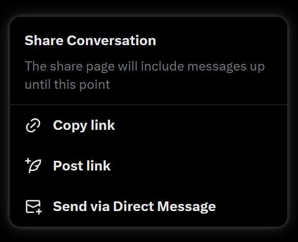

2. 在弹出菜单里选**发帖链接**(和手机版图标一样),就能自动创建帖子了

## 怎么编辑Grok生成的图片?

Grok最近加入了图片编辑功能,给你几种修改方式。

最简单的方法是在输入框里选**编辑图片**按钮,然后输入修改要求。但这种方式会同时修改两张图片,效果不一定理想。

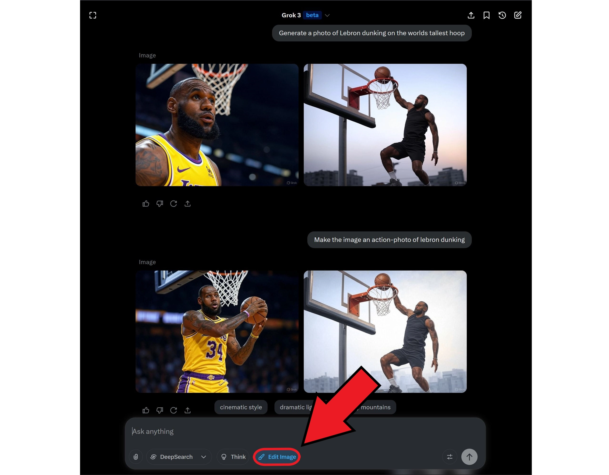

更好的办法是把鼠标放在某张图片上,点击**编辑**按钮。这样可以单独修改这张图片,输入更具体的修改要求。

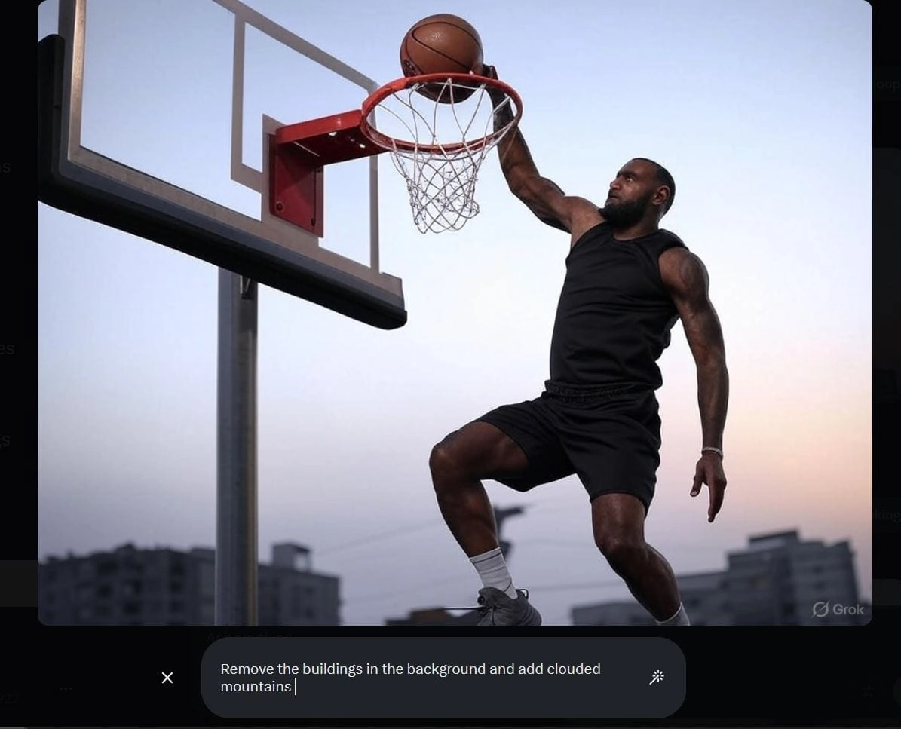

这种方式更适合调整背景或整体风格。而且Grok会生成两个修改版本,你可以选择更好的那个,或者继续修改。

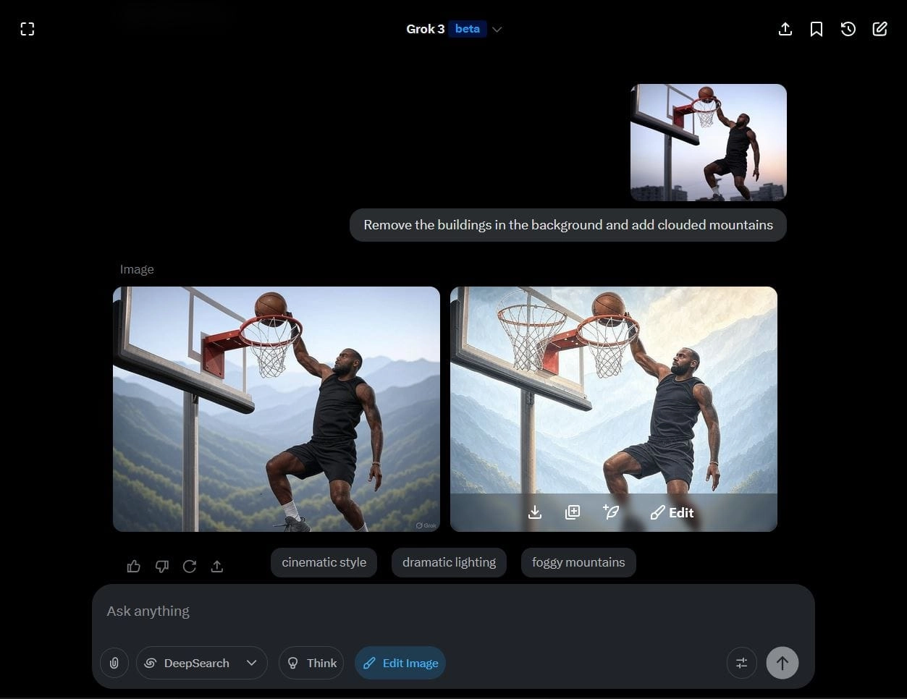

虽然Grok在生成图片方面很强,但它缺少一些基本编辑功能,比如调整尺寸、添加文字、分层编辑等。所以想把Grok图片做成真正能用的内容,还得靠外部编辑工具。

### 用外部工具调整图片尺寸

Grok生成的图片默认是960x640像素。想改尺寸?得用外部编辑器。

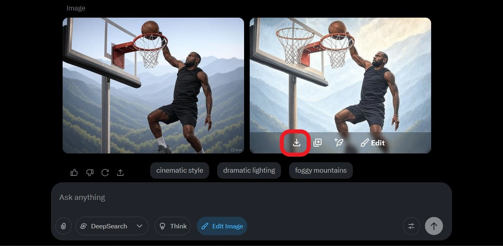

在Kapwing这类工具上,你可以:

- **AI图片扩展:** 用AI生成更大的背景,让图片自然延伸
- **社交媒体预设:** 快速调整到TikTok、Instagram、YouTube、X等平台的标准尺寸
- **自定义尺寸:** 输入任何你想要的像素大小

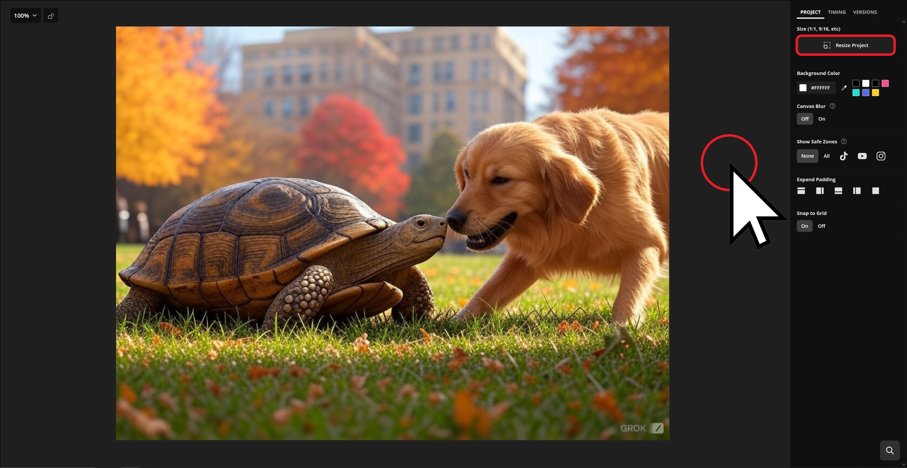

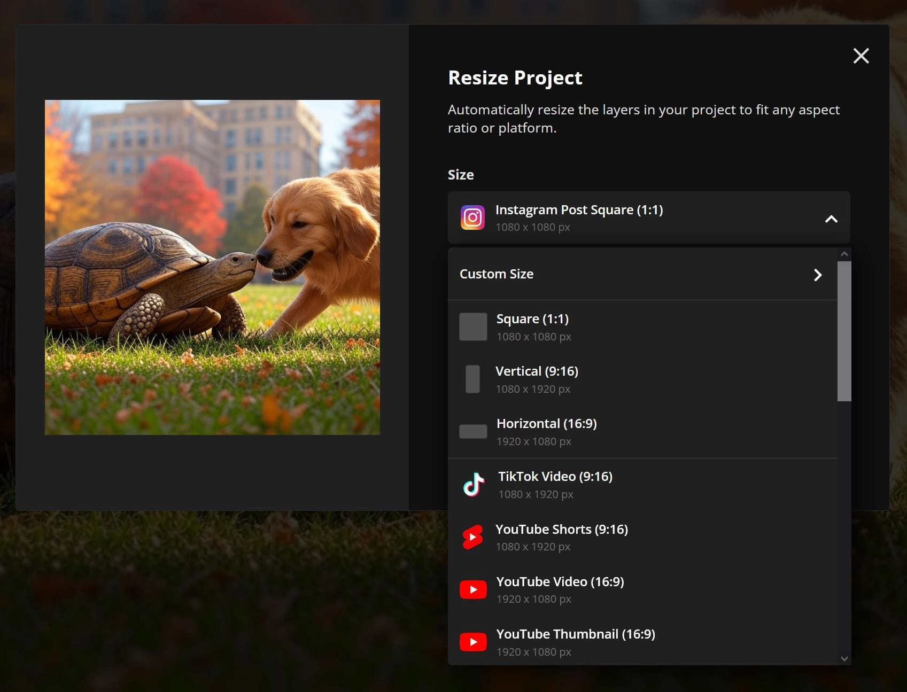

### 用Kapwing增强图片效果

Kapwing提供了很多实用功能:

- **文字叠加:** 添加自定义字体、颜色、边框。还能上传自己的字体来强化品牌。
- **形状和元素:** 加入各种图形、图标,让内容更突出。
- **背景移除:** 快速去除背景,做出更干净的设计。
- **图层调整:** 重新排列元素,创造层次感。
- **模板:** 使用预设布局节省时间,比如表情包模板。
- **视觉调整:** 调整透明度、亮度、对比度、饱和度和模糊效果。

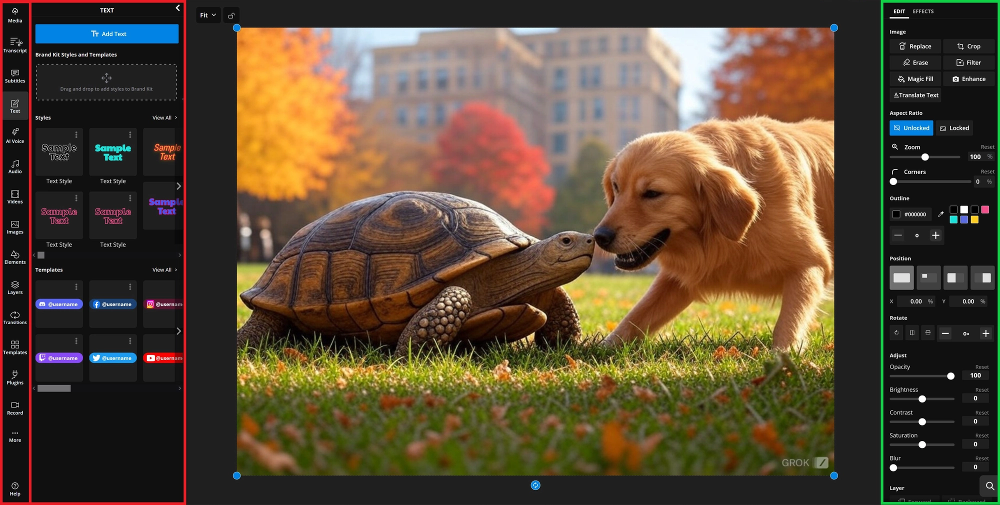

### 导出和分享

编辑完成后,点击右上角的**"导出项目"**按钮。你可以直接分享到社交媒体,或者下载保存。

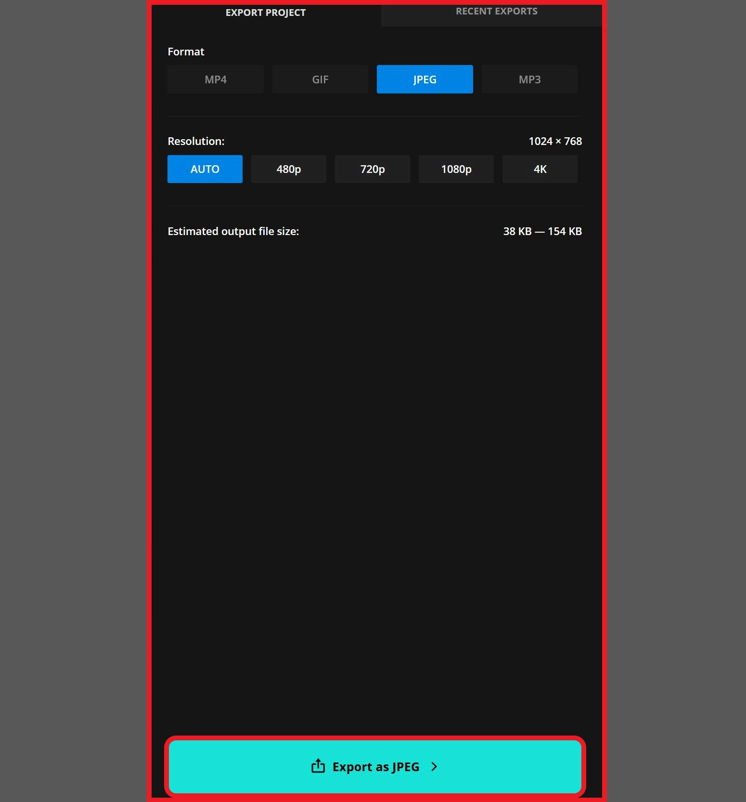

Kapwing让创作者能高效产出专业内容,是Grok生成图片的完美搭档。无论你是做品牌视觉、视频封面还是多平台营销,Kapwing都能简化你的工作流程,提升创作质量。

## X Premium会提供更多Grok功能吗?

X表示每个高级订阅等级都会增加图片和文字额度,但目前还没公布具体数字。

---

Grok现在对所有用户免费开放,这意味着你不用花钱就能体验AI图片生成。虽然免费版有一些限制,但对于大多数人来说已经够用了。想要更高的使用额度和更多功能?👉 [Grok Super会员一个月成品号(质保30天)提供完整体验,无需等待即可解锁全部功能](https://shaoyumi.com/buy/66)。无论是生成创意图片、编辑细节还是发布到X平台,Grok都让整个过程变得简单有趣。
